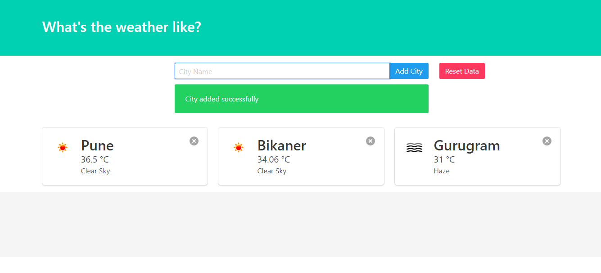

# WeatherApp

Users can searched for the cities of their choice.
User can search and compare weather of 3 cities at a time.

The data of user with the latest search cities will be saved in cookies. This way user do not need to register/login to store the city names.

